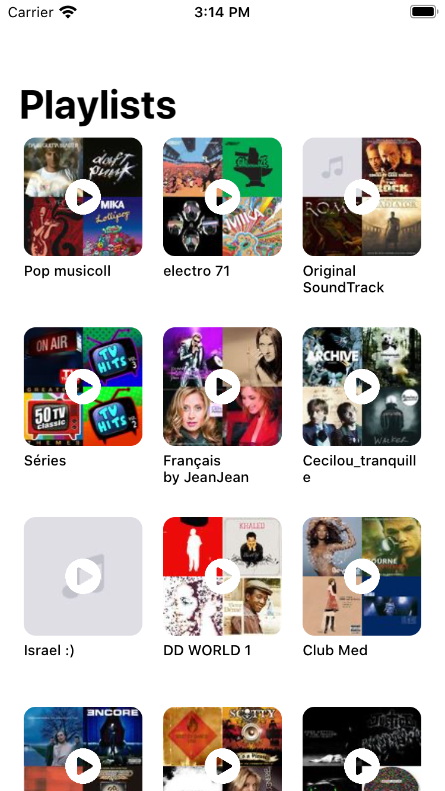
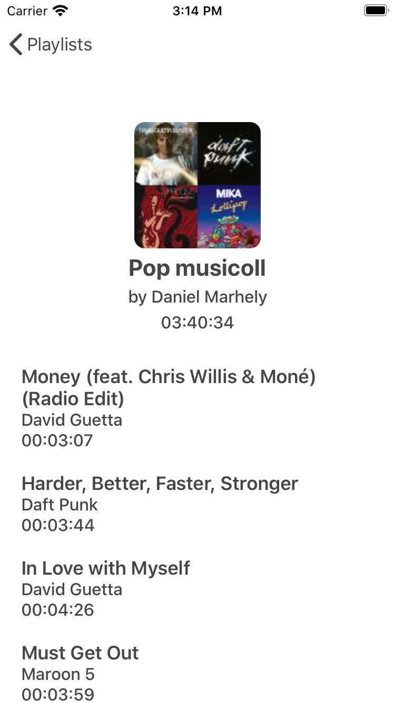

# playlists

Playlist is an iOS application that displays music playlists from the [Deezer API](https://developers.deezer.com/api/explorer). 

## Technical Specifications
* Swift 5
* MVVM Architecture
* RxSwift
* Alamofire, Alamofire Image

## Instructions
* Download the project files.
* Run `pod install`
